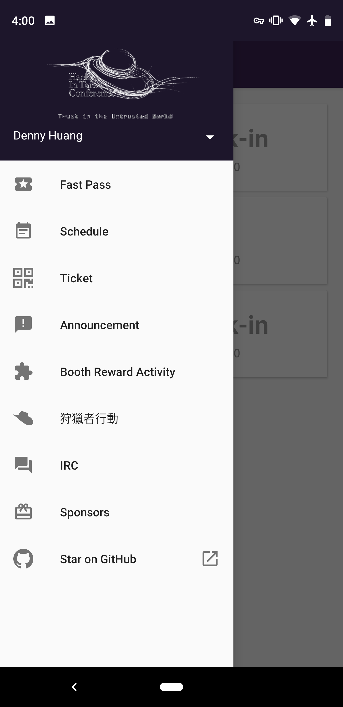
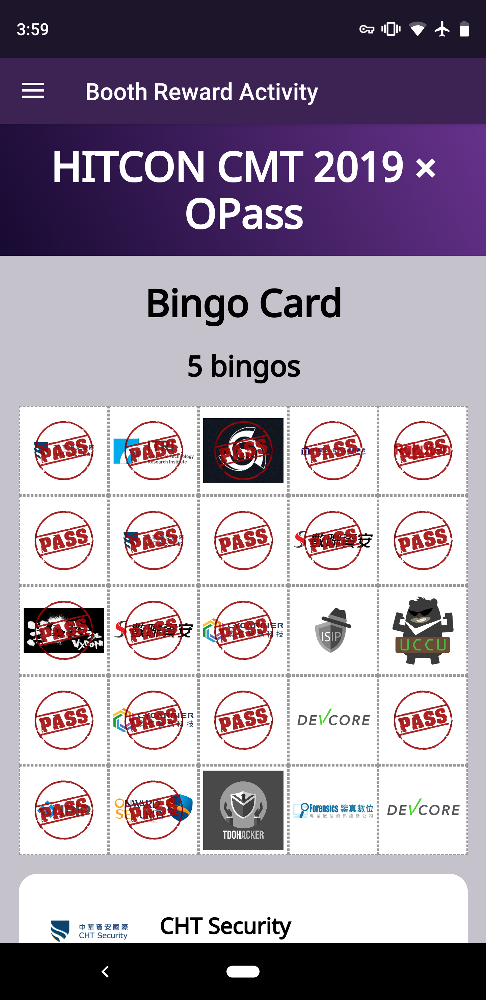
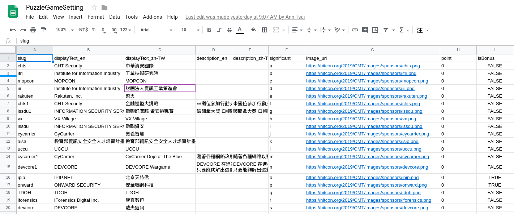

title: OPass 專案回顧及展望
output: index.html

--

<h1 style="font-size: 84px">
  OPass 
  專案回顧及展望
</h1>
 
## Denny Huang

--

  

--

# ~= 50 人 / min
## 1900人 * 80% / 30min

--

# COSCUP 2016

--

  

--

  

--

  

--

### Conferences

- COSCUP

- SITCON

- PyCon TW

- g0v summit

- HITCON

--

# [Portal](https://github.com/CCIP-App/Portal)

--

  

--

  

--

  

--

* [CCIP-Android](https://github.com/CPRTeam/CCIP-Android)

* [CCIP-iOS](https://github.com/CPRTeam/CCIP-iOS)

* [CCIP-Server](https://github.com/CPRTeam/CCIP-Server)

--

# [CCIP-Admin-Bueno](https://github.com/CCIP-App/CCIP-Admin-Bueno/)

--

  

--

# [schedule-json-generator](https://github.com/CCIP-App/schedule-json-generator)

--

  

--

  
  

--

  

--

# 大地遊戲
## [CCIP-Puzzle-Chocolate](https://github.com/CCIP-App/CCIP-Puzzle-Chocolate)
## [CCIP-Puzzle-Config-Generator-Chocolate](https://github.com/CCIP-App/CCIP-Puzzle-Config-Generator-Chocolate)

--

  

--

  

--

# 安裝率

--

# 84.4%
## 1615 / 1914

--

# 報到率

--

# 81%
## 1549 / 1914

--

  

--

  

--

  

--

  

--

  

--

  

--

   
  

--

<h1 style="font-size: 52px">
  https://github.com/CCIP-App/
</h1>

--

# [OPass.app](https://opass.app/)

--

<h1 style="font-size: 84px">
  SITCON 2020 
  2020 / 03 / 28
</h1>
